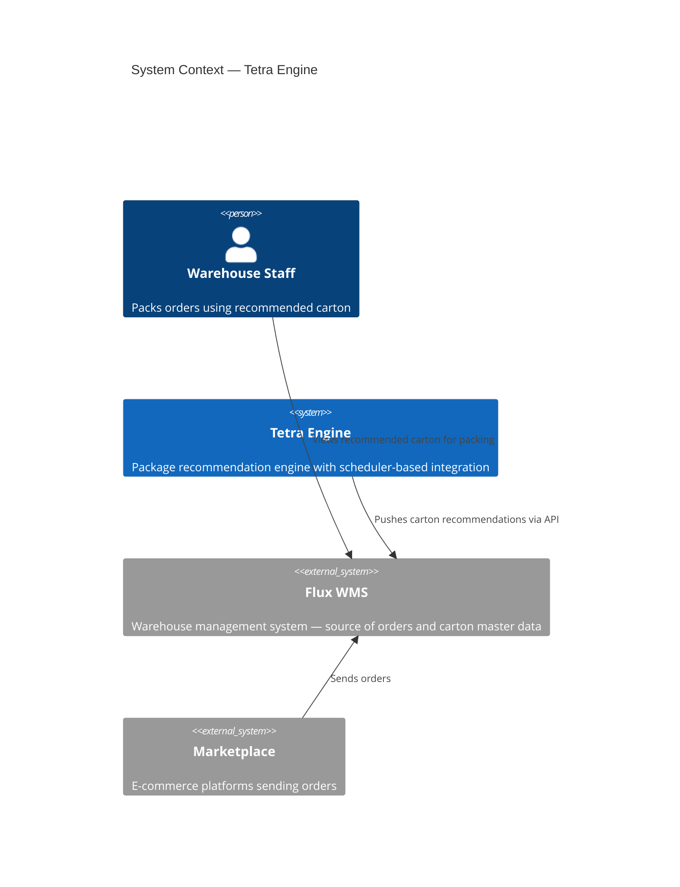
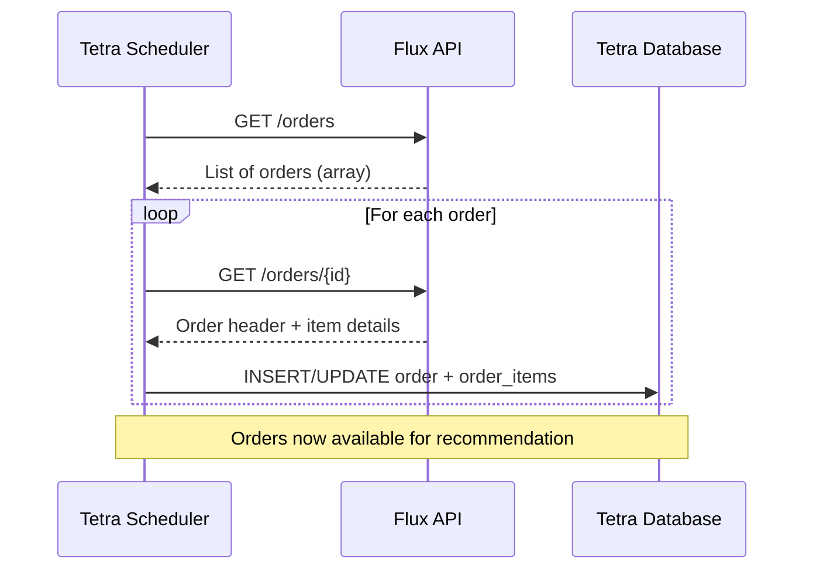
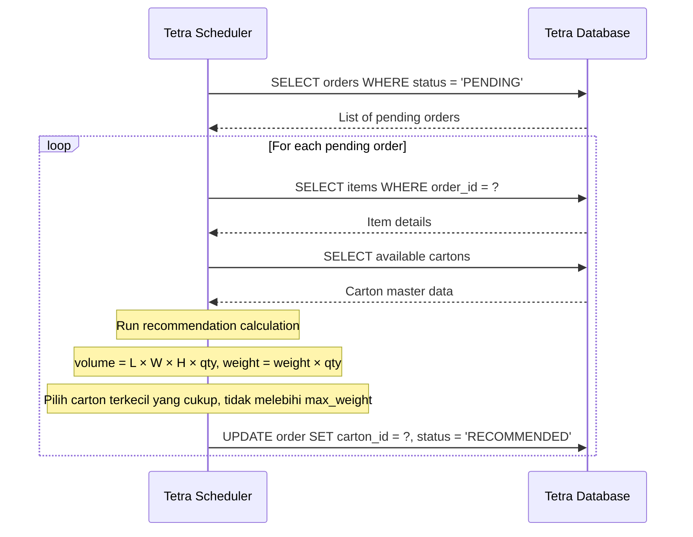
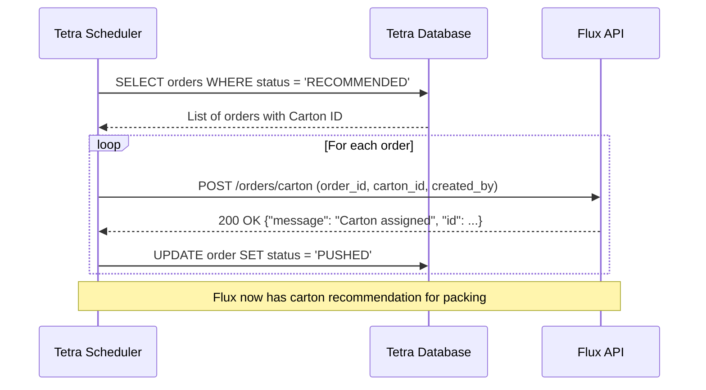
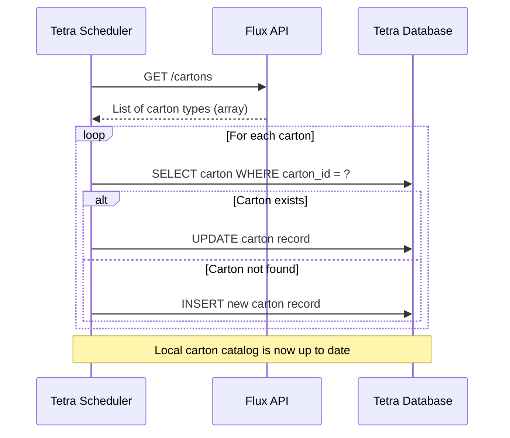
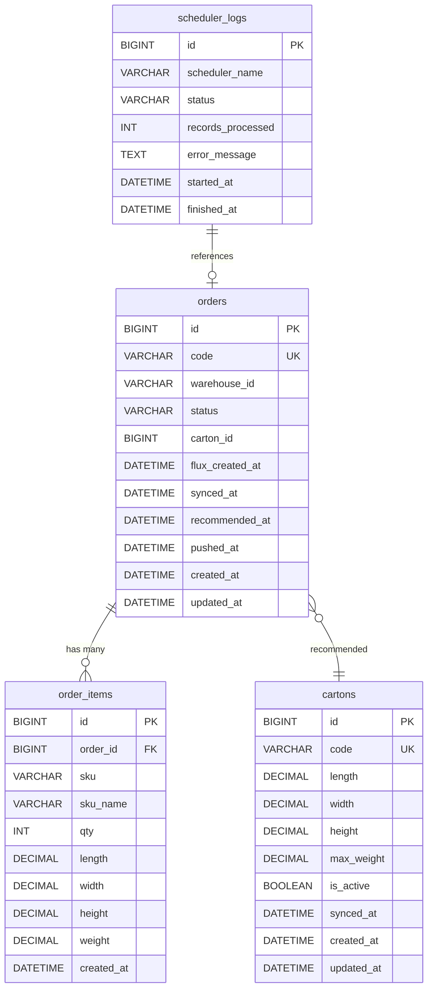

# Tetra — Architecture Design  
## System Integration & Database Design  

**Document Version:** 1.1  
**Date:** 2026-04-30  
**Status:** Ready To Development  
**Reference:** [Tetra Product Design](../prd/tetra-product-design.md)  

---

## 1. Overview  

This document describes the architecture-level integration between **Tetra Engine** and **Flux WMS**.  
It covers sequence diagrams for each scheduler flow, the database table structures for Tetra's local database,  
and the API specifications for all integration points.  

This document focuses on **system integration and data design** — not application-level code or internal algorithms.  

**Technical Specification:**
```Engine: Developed using Go (Golang) with Gin or Echo framework.```
```Database: Utilizes SQL-based persistence, compatible with MySQL, MariaDB, or PostgreSQL.```

---

## 2. System Context  



---

## 3. Sequence Diagrams  

### 3.1 Order Retrieval  

Tetra pulls new orders and their item details from Flux every 15 minutes.  



---

### 3.2 Carton Recommendation  

Internal process — no external API calls. Tetra reads from its own database and writes results back.  



---

### 3.3 Carton Push  

Tetra sends the recommended Carton ID back to Flux for each processed order.  



---

### 3.4 Carton Master Data Sync  

Tetra periodically retrieves the carton catalog from Flux to keep its local copy current.  



---

## 4. Database Design (Tetra)  

Tetra maintains its own local database. The tables below store synced data from Flux  
and the recommendation results produced by Tetra.  

### 4.1 Entity Relationship Diagram  



---

### 4.2 Table: `orders`  

Stores order header data synced from Flux.  

| Column | Type | Nullable | Description |  
|---|---|---|---|  
| `id` | BIGINT | NO | Primary key (auto-increment) |  
| `code` | VARCHAR(50) | NO | Unique order code from Flux (e.g., `SO-20260401-012`) |  
| `warehouse_id` | VARCHAR(50) | YES | Warehouse identifier from Flux (e.g., `WH-BDG-01`) |  
| `status` | VARCHAR(20) | NO | Order processing status (see below) |  
| `carton_id` | VARCHAR(50) | YES | reference to `cartons.id` — assigned after recommendation |  
| `flux_created_at` | DATETIME | YES | Original order creation time in Flux |  
| `synced_at` | DATETIME | YES | When the order was synced from Flux |  
| `recommended_at` | DATETIME | YES | When the carton recommendation was produced |  
| `pushed_at` | DATETIME | YES | When the Carton ID was pushed back to Flux |  
| `created_at` | DATETIME | NO | Record creation timestamp |  
| `updated_at` | DATETIME | NO | Record last update timestamp |  

**Status values:**  

| Status | Description |  
|---|---|  
| `SYNCED` | Order retrieved from Flux, awaiting recommendation |  
| `PENDING` | Ready for recommendation processing |  
| `RECOMMENDED` | Carton ID assigned, awaiting push to Flux |  
| `PUSHED` | Carton ID successfully sent to Flux |  
| `ERROR` | Processing failed — requires investigation |  

---

### 4.3 Table: `order_items`  

Stores item-level details for each order, synced from Flux.  

| Column | Type | Nullable | Description |  
|---|---|---|---|  
| `id` | BIGINT | NO | Primary key (auto-increment) |  
| `order_id` | BIGINT | NO | FK to `orders.id` |  
| `sku` | VARCHAR(50) | NO | Product SKU (e.g., `SKU-LAP-ASUS-VIVO`) |  
| `sku_name` | VARCHAR(255) | YES | Human-readable product name |  
| `qty` | INT | NO | Quantity of this item in the order |  
| `length` | DECIMAL(10,2) | NO | Item length in centimeters |  
| `width` | DECIMAL(10,2) | NO | Item width in centimeters |  
| `height` | DECIMAL(10,2) | NO | Item height in centimeters |  
| `weight` | DECIMAL(10,2) | NO | Item weight in grams |  
| `created_at` | DATETIME | NO | Record creation timestamp |  

---

### 4.4 Table: `cartons`  

Stores carton master data synced from Flux.  

| Column | Type | Nullable | Description |  
|---|---|---|---|  
| `id` | BIGINT | NO | Primary key (auto-increment) |  
| `code` | VARCHAR(50) | NO | Unique carton code from Flux (e.g., `CB01S`) |  
| `length` | DECIMAL(10,2) | NO | Inner length in centimeters |  
| `width` | DECIMAL(10,2) | NO | Inner width in centimeters |  
| `height` | DECIMAL(10,2) | NO | Inner height in centimeters |  
| `max_weight` | DECIMAL(10,2) | NO | Maximum weight capacity in **kilogram** |  
| `is_active` | BOOLEAN | NO | Whether this carton is currently available |  
| `synced_at` | DATETIME | YES | Last sync timestamp from Flux |  
| `created_at` | DATETIME | NO | Record creation timestamp |  
| `updated_at` | DATETIME | NO | Record last update timestamp |  

---

### 4.5 Table: `scheduler_logs`  

Tracks execution history for each scheduler run.  

| Column | Type | Nullable | Description |  
|---|---|---|---|  
| `id` | BIGINT | NO | Primary key (auto-increment) |  
| `scheduler_name` | VARCHAR(50) | NO | Name of the scheduler (e.g., `order_retrieval`) |  
| `status` | VARCHAR(20) | NO | Run status: `RUNNING`, `SUCCESS`, `FAILED` |  
| `records_processed` | INT | YES | Number of records processed in this run |  
| `error_message` | TEXT | YES | Error details if the run failed |  
| `started_at` | DATETIME | NO | When the scheduler run started |  
| `finished_at` | DATETIME | YES | When the scheduler run completed |  

---

## 5. API Specifications  

All APIs below are **Flux endpoints** consumed by Tetra.  
Tetra acts as the **client**; Flux acts as the **server**.  

**Base URL:** `https://mock-api-anteraja.vercel.app`  

---

### 5.1 Get Orders  

Retrieve a list of orders from Flux.  

| Property | Value |  
|---|---|  
| **Endpoint** | `GET /orders` |  
| **Direction** | Tetra → Flux |  
| **Trigger** | Order Retrieval Scheduler (every 15 min) |  

**Response Body (200 OK):**  

```json
[
  {
    "id": 12,
    "code": "SO-20260401-012",
    "warehouse_id": "WH-BDG-01",
    "carton_id": "CTN-BDG-007",
    "created_at": "2026-04-29T12:19:22+07:00",
    "updated_at": "2026-04-29T12:19:22+07:00"
  }
]
```

**Response Fields:**  

| Field | Type | Description |  
|---|---|---|  
| `id` | integer | Numeric order ID (used as path param in subsequent calls) |  
| `code` | string | Human-readable order code |  
| `warehouse_id` | string | Warehouse identifier |  
| `carton_id` | string | Currently assigned carton (if any) |  
| `created_at` | datetime | Order creation time (Jakarta timezone, UTC+7) |  
| `updated_at` | datetime | Last update time (Jakarta timezone, UTC+7) |  

---

### 5.2 Get Order Detail  

Retrieve header and item-level details for a specific order.  

| Property | Value |  
|---|---|  
| **Endpoint** | `GET /orders/{id}` |  
| **Direction** | Tetra → Flux |  
| **Trigger** | Order Retrieval Scheduler (every 15 min) |  

**Path Parameters:**  

| Parameter | Type | Required | Description |  
|---|---|---|---|  
| `id` | integer | Yes | The numeric order ID from Get Orders response |  

**Response Body (200 OK):**  

```json
{
  "order": {
    "id": 12,
    "code": "SO-20260401-012",
    "warehouse_id": "WH-BDG-01",
    "carton_id": "CTN-BDG-007",
    "created_at": "2026-04-29T12:19:22+07:00",
    "updated_at": "2026-04-29T12:19:22+07:00"
  },
  "details": [
    {
      "id": 31,
      "order_id": 12,
      "sku": "SKU-LAP-ASUS-VIVO",
      "sku_name": "Asus VivoBook 14 Laptop",
      "qty": 1,
      "length": "35.00",
      "width": "25.00",
      "height": "5.00",
      "weight": "1.70",
      "created_at": "2026-04-29T12:19:27+07:00"
    }
  ]
}
```

**Response Fields — `details[]`:**  

| Field | Type | Unit | Description |  
|---|---|---|---|  
| `id` | integer | — | Item record ID |  
| `order_id` | integer | — | Parent order ID |  
| `sku` | string | — | Product SKU |  
| `sku_name` | string | — | Human-readable product name |  
| `qty` | integer | — | Quantity in the order |  
| `length` | string (decimal) | cm | Item length |  
| `width` | string (decimal) | cm | Item width |  
| `height` | string (decimal) | cm | Item height |  
| `weight` | string (decimal) | gram | Item weight |  
| `created_at` | datetime | — | Record creation time (Jakarta timezone, UTC+7) |  

---

### 5.3 Get Cartons  

Retrieve the full carton master data catalog from Flux.  

| Property | Value |  
|---|---|  
| **Endpoint** | `GET /cartons` |  
| **Direction** | Tetra → Flux |  
| **Trigger** | Carton Master Sync Scheduler |  

**Response Body (200 OK):**  

```json
[
  {
    "id": 1,
    "code": "CB01S",
    "length": "20.00",
    "width": "16.00",
    "height": "6.00",
    "max_weight": "5.00"
  }
]
```

**Response Fields:**  

| Field | Type | Unit | Description |  
|---|---|---|---|  
| `id` | integer | — | Numeric carton ID |  
| `code` | string | — | Unique carton code (used as `carton_id` when assigning) |  
| `length` | string (decimal) | cm | Inner length |  
| `width` | string (decimal) | cm | Inner width |  
| `height` | string (decimal) | cm | Inner height |  
| `max_weight` | string (decimal) | **kg** | Maximum weight capacity |  

> **Note:** `max_weight` is in **kilogram**, while item `weight` from order details is in **gram**.  
> Tetra must convert units before comparison during recommendation calculation.  

---

### 5.4 Assign Carton  

Push the carton recommendation result back to Flux.  

| Property | Value |  
|---|---|  
| **Endpoint** | `POST /orders/carton` |  
| **Direction** | Tetra → Flux |  
| **Trigger** | Carton Push Scheduler |  

> **Note:** This endpoint accepts repeated calls for the same order (idempotent-friendly).  
**Request Body:**  

```json
Content-Type: application/json

{
  "order_id": 1,
  "carton_id": "7",
  "created_by": "{YOUR_EMAIL_ADDRESS}"
}
```

**Request Fields:**  

| Field | Type | Required | Description |  
|---|---|---|---|  
| `order_id` | integer | Yes | Numeric order ID (from Get Orders `id` field) |  
| `carton_id` | string | Yes | Carton id to assign (from Get Cartons `id` field) |  
| `created_by` | string | Yes | Identifier of the actor performing the assignment |  

**Response Body (200 OK):**  

```json
{
  "message": "Carton assigned",
  "id": 123
}
```

---

## 6. Integration Summary  

| # | Flow | Endpoint | Method | Direction | Frequency |  
|---|---|---|---|---|---|  
| 1 | Order Retrieval | `/orders` | GET | Tetra → Flux | Every 15 min |  
| 2 | Order Retrieval | `/orders/{id}` | GET | Tetra → Flux | Every 15 min |  
| 3 | Carton Push | `/orders/carton` | POST | Tetra → Flux | Periodic |  
| 4 | Carton Master Sync | `/cartons` | GET | Tetra → Flux | Periodic |  

> **Note:** All communication is **unidirectional** — Tetra always initiates.  
> Flux does not call Tetra. There are no webhooks or event-driven triggers.  

---

## 7. Key Design Decisions  

- **Local database copy:** Tetra maintains its own copy of orders and carton master data  
  to avoid runtime dependency on Flux API availability during recommendation calculations.  
- **Scheduler-based integration:** All data exchange is scheduler-driven (pull/push pattern),  
  keeping the integration simple and decoupled.  
- **Status-driven processing:** Orders move through a defined status lifecycle  
  (`SYNCED` → `PENDING` → `RECOMMENDED` → `PUSHED`), ensuring each step is idempotent and traceable.  
- **Recommendation rules:** Carton is selected based on volume (`L × W × H × qty`) and weight (`weight × qty`),  
  choosing the smallest carton that fits without exceeding `max_weight`.  
- **Unit conversion:** Item weight from Flux is in **gram**; carton `max_weight` from Flux is in **kilogram**.  
  Tetra normalizes units internally before comparison.  
- **Scheduler logging:** Every scheduler run is logged for observability and troubleshooting.  
- **Timestamps in Jakarta timezone:** All datetime values follow the Jakarta timezone (UTC+7)  
  consistent with warehouse operations.  

---

## 8. Out of Scope  

- Application-level code design (classes, modules, frameworks)  
- Recommendation algorithm internals  
- Authentication and authorization mechanisms  
- Deployment architecture (containers, servers, CI/CD)  
- Monitoring and alerting setup  
- Performance tuning and load testing  

---

*End of Document*